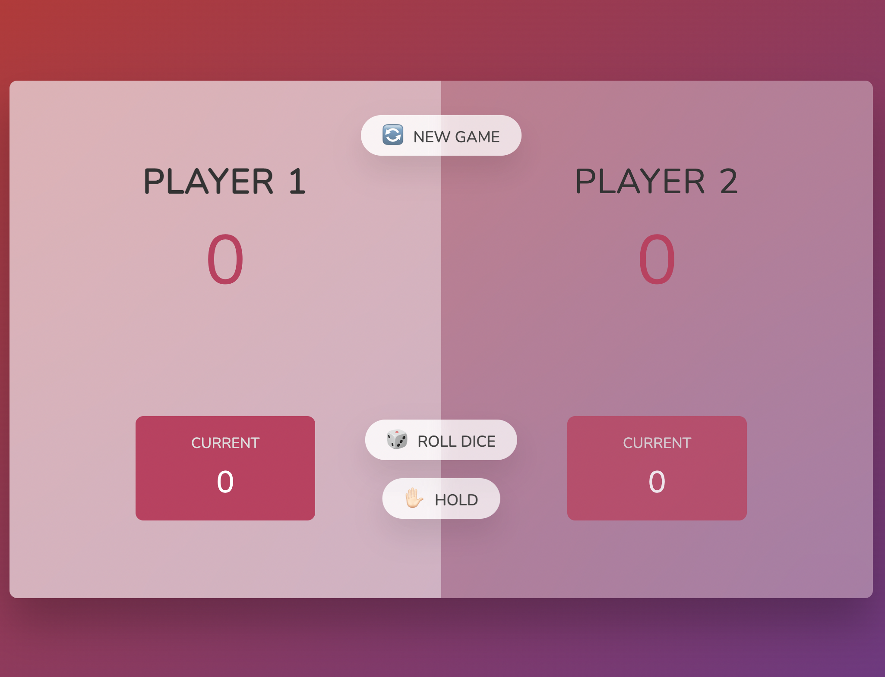
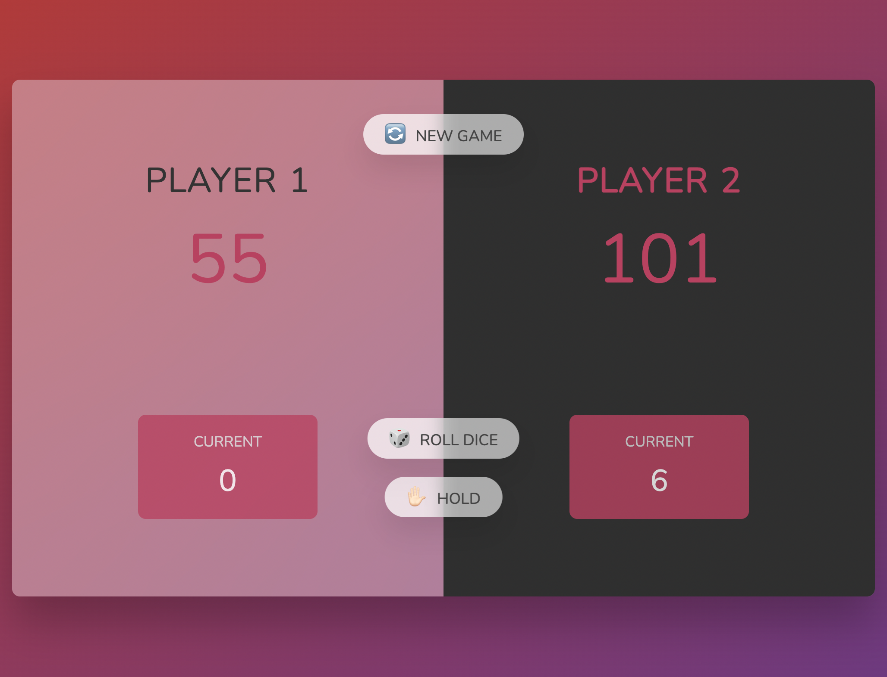

# 🐽 Pig Game

## 👉 This is a game that I have made as to enhanced my JavaScript's skills:

The aim of the game is to reach 💯 points.
Everytime that the die is rolled a random number will appear, and the number will be add the current score of the player but will only adds up to the actual score once the player holds its turn passing it over to the next player. If the player rolls #1 on the die, the current score is lost and the turn is given to the next player.

Which ever player reaches out 💯 points first, wins the game 🏆 and its background color is changed to night rider style.

## 👉 A new game can be initialized by pressing the NEW GAME 🔄 button.

🙃 Have Fun!!!
